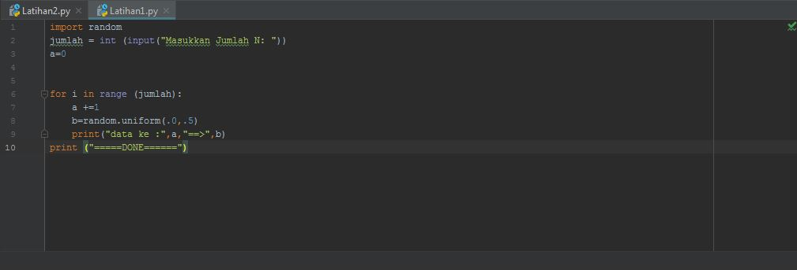
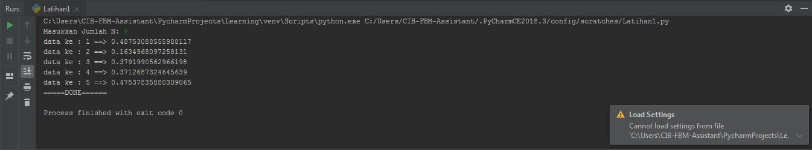
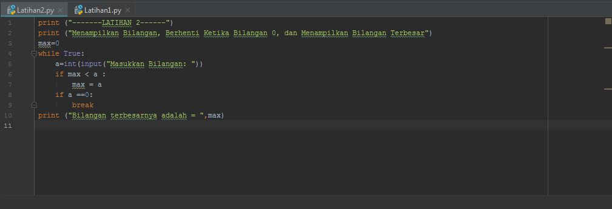
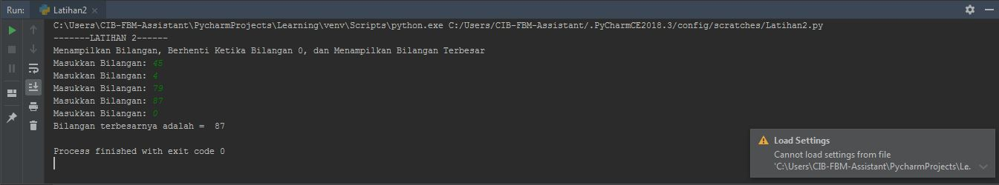
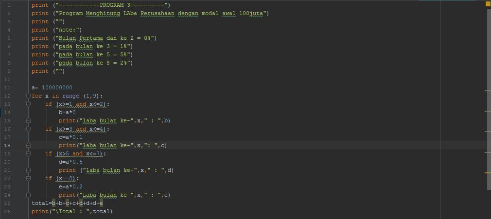
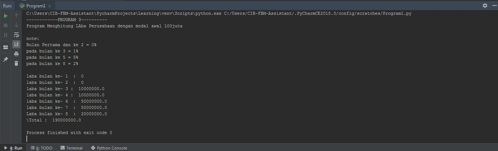

# labpy03

**latihan 1 :**

Soal latihan 1 :

* Tampilkan N bilangan acak yang lebih kecil dari 0,5.

* Nilai N diisi pada saat runtime.

* Anda bisa menggunakan kombinasi while dan for untuk menyelesaikannya

* Gunakan fungsi random() yang dapat diimport terlebih dahulu

Algoritma latihan1 :

Menampilkan N bilangan acak yang lebih kecil dari 0,5, nilai n diisi 
pada saat runtime.

* Memasukan/ import fungsi RANDOM terlebih dahulu

* Deklarasi integer , masukkan jumlah n :

* Memasukan deskripsi kombinasi for untuk menyelesaikannya.

* Memasukan nilai jumlah (n) : 5

* Mencetak data ke 1 sampai 5 dengan hasil nilai kurang dari 0,5.

* Selesai

Syntax Latihan1 :

#  <h2>

Hasil output Latihan1:

#  <h2>

**Soal Latihan 2 :**

Membuat program untuk menampilkan bilangan terbesar dari n buah data 
yang diinputkan.Masukkan angka 0 untuk berhenti.

Algoritma latihan 2:

Membuat program untuk menampilkan bilangan terbesar dari n buah data 
yang diinputkan.Masukkan angka 0 untuk berhenti

* Mulai

* Mencetak "latihan 2"

* Mencetak "menampilkan bilangan, berhenti ketika bilangan 0, 
menampilkan bilangan terbesar"

* Integer max = 0

* Menggunakan fungsi perulangan while true, hingga menampilkan 
perulangan sampai batas tertentu.

* Memasukan bilangan integer pada "a"

* Menggunakan fungsi if jika max kurang dari nilai a, maka max sama 
dengan a

* Mengunakan fungsi if jika nilai a adalah 0 maka fungsi break artinya 
perulangan berhenti jika menulis nilai 0.

* Mencetak nilai paling terbesarv setelah break, sehingga menampilkan 
nilai terbesar diantara bilangan tersebut dalam perulangan.

* Selesai

Syntax Latihan2 :

#  <h2>

Hasil output latihan 2 ketika di runfile :

#  <h2>

**Soal program 1 :**

Membuat program sederhana dengan perulangan :

Seorang pengusaha menginvestasikan uangnya untuk memulai usahanya dengan 
modal awal 100 juta,

Pada bulan pertama dan kedua belum mendapatkan laba.

Pada bulan ketiga baru mulia mendapatkan laba sebesar 1%

Pada bulan ke lima pendapatan meningkat 5%

Pada bulan ke delapan mengalami penurunan keuntungan sebesar 2%, 
sehingga laba menjadi 3%.

Hitung total keuntungan selama 8 bulan berjalan usahanya.

ALGORITMA menghitung keuntungan selama 8 bulan berjalannya usaha.

* Mulai

* Mencetak latihan1

* Mencetak "Program menghitung laba dengan modal awal 100 juta"

* Membuat Note

* Mencetak Bulan pertama dan kedua = 0%

* Mencetak bulan ke 3 = 1%

* Mencetak bulan ke 5 = 5%

* Mencetak bulan ke 8 = 2%

* Integer a = 100.000.000( modal awal)

* Menggunakan fungsi looping for pada nilai x 1-9 untuk menampilkan 
bulan 1 sampai bulan 8.

* Menggunakan fungsi if, untuk menghitung laba bulan 1 sampai 8

* Bulan pertama dan kedua laba adalah 0

* Bulan ke 3 dan ke 4 mendapat laba 1% sehingga modal di kali 1% = 
keuntungan

* Bulan ke 5 mendapatkan laba 5%, sehingga modal dikali 5% = 
keuntungan

* Bulan ke 8 mmendapatkan laba 2% sehingga keuntungan menurun dari 
bulan sebelumnya, modal dikali 2% = keuntungan.

* Menghitung jumlah total laba dengan menjumlah keuntungan dari bulan 
ke 1 sampai bulan 8, hasilnya adalah total keuntungan yang didapat.

* Selesai

Syntax Program1 :

#  <h2>

Hasil output Program1 ketika runfile :

#  <h2>
